# 🛍️ TechHub - E-Commerce Web Application

TechHub is a full-stack E-Commerce platform built using **Java Spring Boot**, designed to offer a seamless shopping experience to users and powerful admin tools for managing products, brands, categories, and orders.

> 📅 Developed as part of an MCA Final Semester Internship Project at **SSM Infotech Solutions, Surat**  
> 👨‍💻 Submitted by: Mahmaduvesh Zakirhusen Mullan 
> 📆 Duration: December 2023 – May 2024

---

## 📌 Table of Contents
- [Features](#features)
- [Tech Stack](#tech-stack)
- [UI Screenshots](#ui-screenshots)
- [Database Tables](#database-tables)
- [Installation](#installation)
- [Contributing](#contributing)
- [License](#license)

---

## ✅ System Features

### 👤 User Module
- User Registration & Login (with encoded passwords)
- View Products by Category/Brand
- Add to Cart, Update Cart, Remove from Cart
- Checkout & Order Placement
- Razorpay Payment Integration

### 🛒 Admin Module
- Add/Edit/Delete Brands, Categories, Products
- Product Image Upload & Validation
- View Sales Reports & Customer Orders
- Inventory & Stock Management

---

## 🔧 Tech Stack

| Layer            | Technology                         |
|------------------|-------------------------------------|
| Backend          | Java Spring Boot                    |
| Frontend         | Thymeleaf, Bootstrap                |
| Database         | MySQL                               |
| Payment Gateway  | Razorpay API                        |
| Styling          | HTML5, CSS3, JavaScript, Bootstrap  |
| Architecture     | MVC (Model-View-Controller)         |

---

## 🖼️ UI Screenshots

| Page                 | Screenshot                         |
|----------------------|------------------------------------|
| Registration Page    | 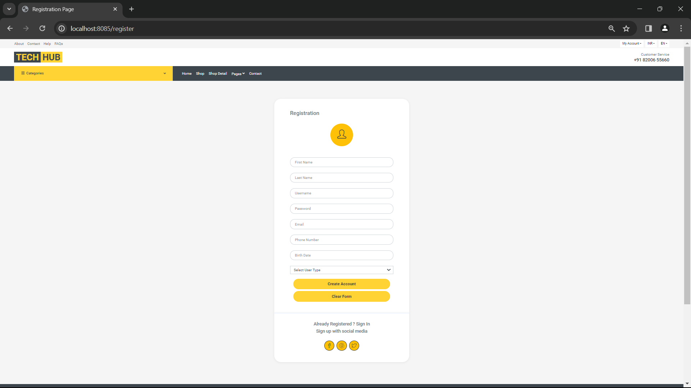 |
| Login Page           | 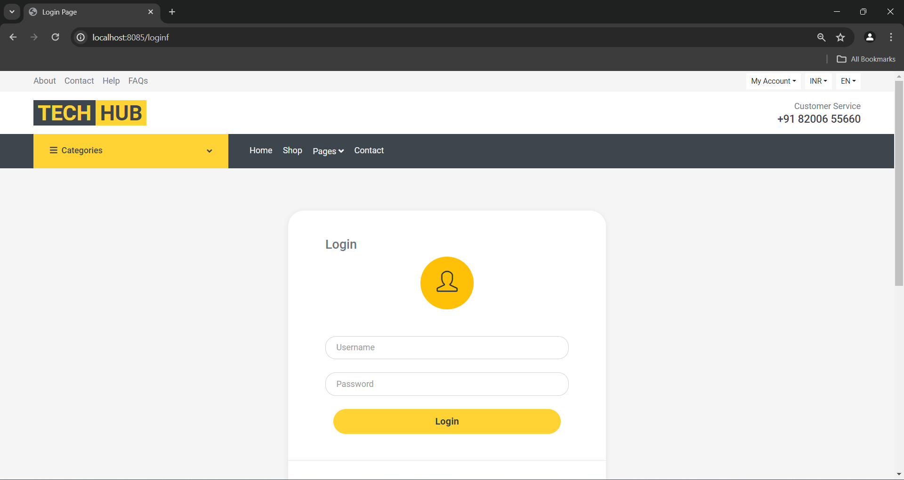             |
| Home Page            | 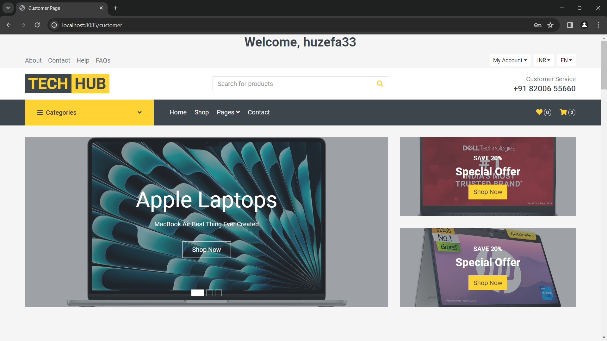               |
| Shop Page            | 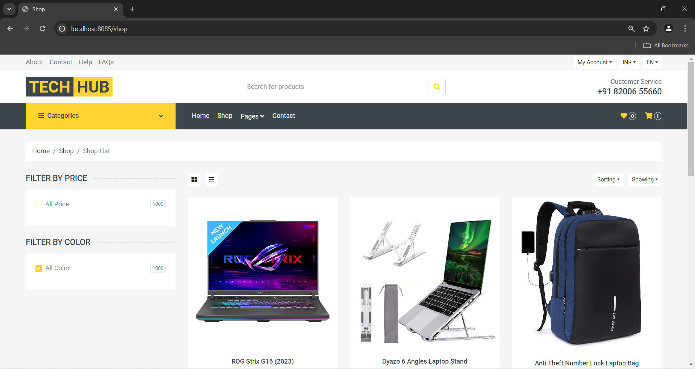               |
| Product Detail       | 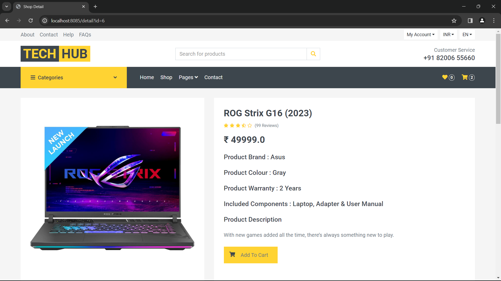 |
| Cart Page            |                |
| Checkout Page        | 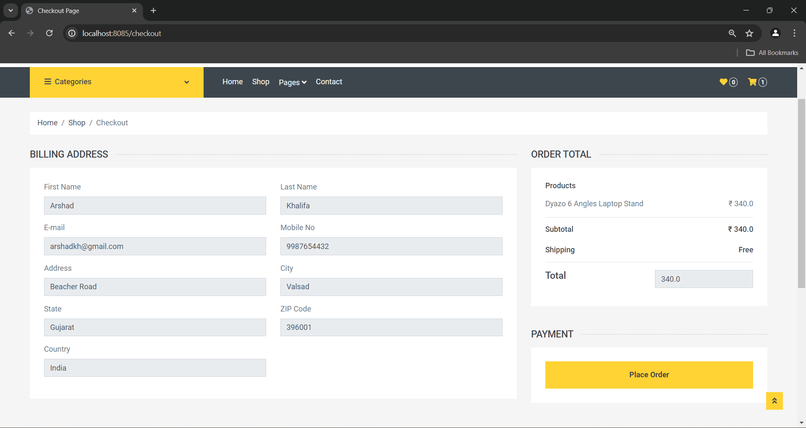       |
| Place Order Page        | 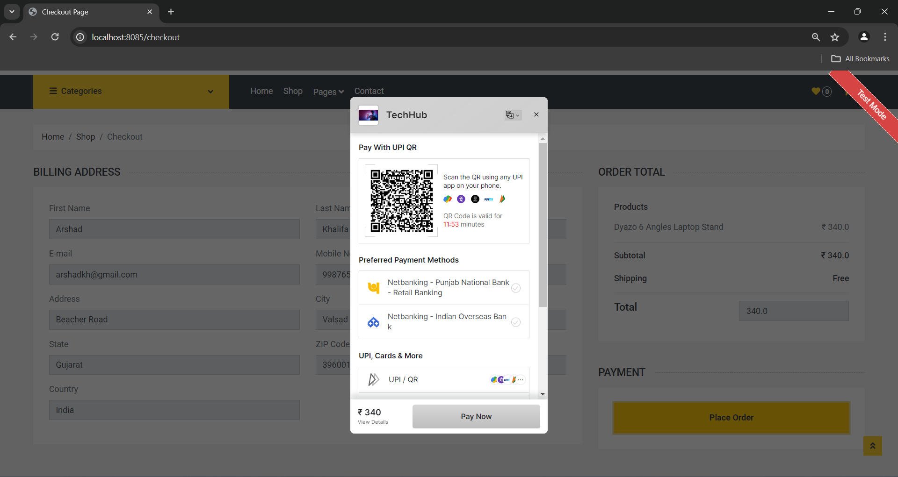 |
| Payment Page        | 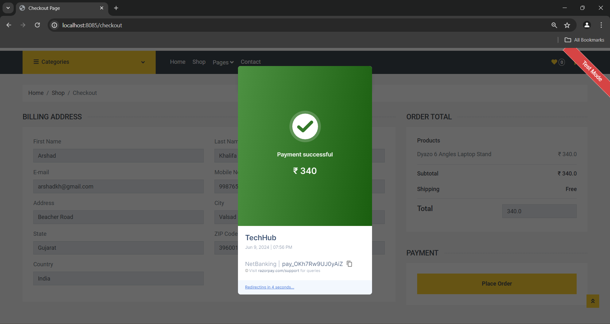          |
| Admin - Add Brand    | 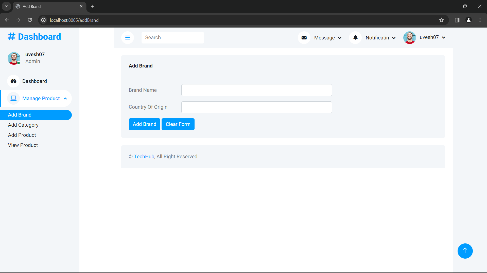   |
| Admin - Add Product  | 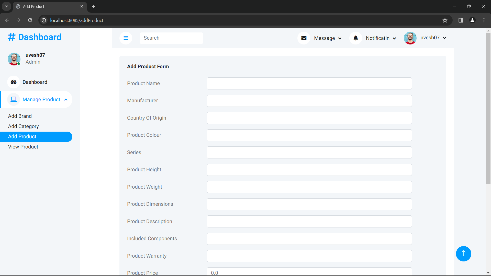 |
| Admin - View Product | 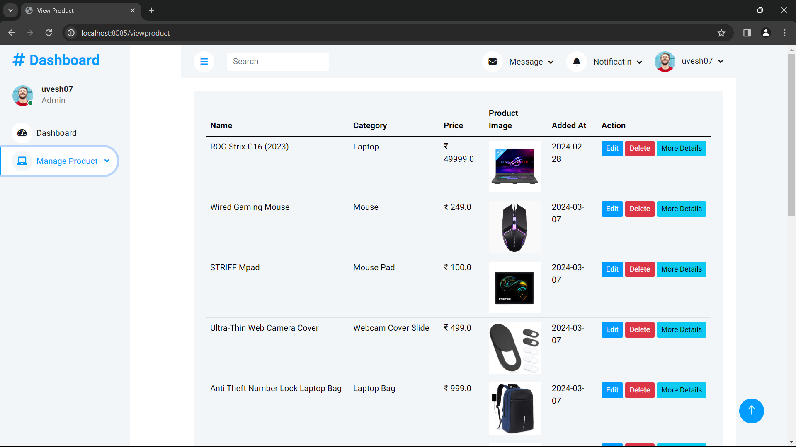 |


---

## 🗄️ Database Tables (MySQL)

Key Tables:

- `Users_Master`: Stores user details
- `Brand_Master`: Stores product brands
- `Category_Master`: Product categories
- `Product_Master`: Products and their specifications
- `Cart_Master` & `Cart_Item`: Cart management
- `Order_Master`: Orders with Razorpay integration

<!-- Refer to the full [data dictionary](#) for detailed schema. -->

---

## ⚙️ Installation

1. **Clone the Repository**
   ```bash
   git clone https://github.com/Uvesh77/TechHub.git
   cd TechHub

2. **Setup the Database**

    Create a MySQL database (e.g., techhub_db)


3. **Update Application Properties**

    Go to src/main/resources/application.properties and update:

    ```bash
    spring.datasource.url=jdbc:mysql://localhost:3306/techhub_db
    spring.datasource.username=root
    spring.datasource.password=yourpassword

4. **Run the App**

    Use your IDE or run via Maven:
    ```bash
    mvn spring-boot:run

5. **Access the App**
    ```bash
    Open browser and go to: http://localhost:8080/
